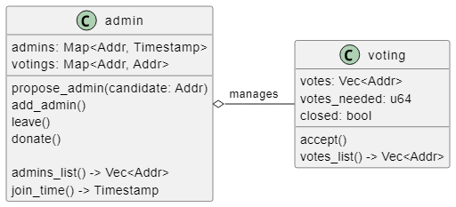

# 5.1. Dizayn

Bu kez sistemimizin tasarımını biraz tartışmaya başlayacağız. Çoklu kontrat sistemleri inşa etmek izole kontratlardan biraz daha karmaşık olma eğilimindedir, bu nedenle bu bölümde size ne inşa ettiğimiz konusunda biraz ipucu vermek istiyorum. Eğer bir tasarımda kaybolduğunuzu hissederseniz endişelenmeyin - kontratları uygularken her şey netleşecektir. Şimdilik, genel bir fikir edinmek için üzerinden geçin.

İlk olarak, çözmek istediğimiz sorunu düşünelim. Adminlerimiz bir adres vektörüdür. Halihazırda admin olan herkes istediği kişiyi listeye ekleyebilir. Ancak bu "herhangi biri" aynı admin hesabının ikinci bir örneği olabilir, bu yüzden bağışlar için iki kez sayılır!

Bu sorunu çözmek nispeten kolaydır, ancak başka bir sorun daha vardır - daha önce öğrendiğimiz gibi, admin yalnızca kendisinin token çekebileceği ve grupta başka bir admin olarak kaydolabileceği bir akıllı kontrat oluşturabilir! Aynı adresin birden fazla kez eklenmesini engellesek bile, bunu birden fazla kez uygulayarak amacına ulaşabilir. Aynı kişinin sahip olduğu birçok farklı adres olacaktır.

Hoş olmayan bir durum gibi görünüyor, ancak bunu yönetmenin yolları var. Bizim uygulayacağımız yöntem oylama. Listeye başka bir admin ekleyebilmek yerine, adminlerin meslektaşlarını yeni adminler olarak önermelerine izin verilecektir. Bu bir oylama süreci başlatacaktır - teklifin oluşturulduğu sırada admin olan herkes bunu destekleyebilecektir. Eğer adminlerin yarısından fazlası yeni adayı desteklerse, o kişi hemen admin olacaktı.

Bu en karmaşık oylama süreci değil, ancak amaçlarımız için yeterli olacaktır.

### [Oylama süreci](5.1.-dizayn.md#oylama-suereci)

Bu hedefe ulaşmak için iki akıllı kontrat oluşturacağız. Birincisi, [Temel Bilgiler](https://book.cosmwasm.com/basics.html) bölümünden yeniden kullanılan bir kontrat olacaktır - bu bir `admin` kontratı olacaktır. Ek olarak, bir `voting` kontratı ekleyeceğiz. Bu kontrat tek bir oylama sürecini yönetmekten sorumlu olacaktır. Bir `admin` arkadaşını bir listeye eklemek istediğinde bir admin kontratı tarafından örneklenecektir. İşte kontratlar ilişkisinin bir diyagramı:

Burada bir admin akış şeması ekleniyor - sözleşmede zaten 5 admin olduğunu, ancak 2'sinin hiçbir şey yapmadığını varsayarsak:

.png>)

Kontratların uygulanması hakkında bazı ipuçları verdim, ancak henüz onlara girmeyeceğim.

### [Mesaj iletme](5.1.-dizayn.md#mesaj-iletme)

Eklemek istediğimiz bir şey daha var - Adminlere iş vermenin bir yolu. `Admin` kontratı, başka bir kontratı çağırmak için bir proxy gibi davranacaktır. Bu, başka bir harici kontratın admin örneğimizi üzerinde yürütme gerçekleştirebilecek belirli bir adres olarak ayarlayacağı ve adminlerin eylemleri bu şekilde gerçekleştireceği anlamına gelir. Harici kontrat, yürütmeyi `admin` kontratının yaptığı gibi görecektir. İşte güncellenmiş bir kontrat şeması:

.png>)

Ve harici kontrat akış şemasını çağırmak:

.png>)

Admin kontratını `execute` mesajındaki `msg`'nin harici kontrata iletilen keyfi bir mesaj olduğuna dikkat edin. Gerçek dünyada base64 kodlu bir mesaj olacaktır, ancak bu sadece bir uygulama detayıdır.

Nihayetinde, böyle bir modelin nasıl kullanılacağını anlamak için basit bir harici kontrat örneği oluşturacağız.

